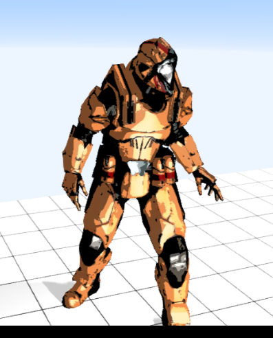
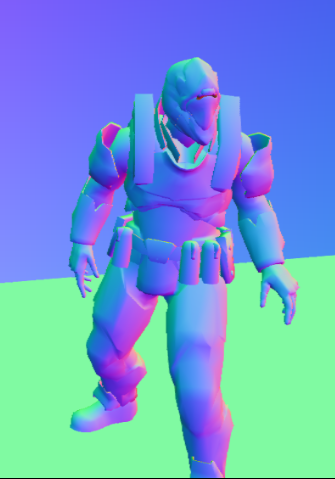
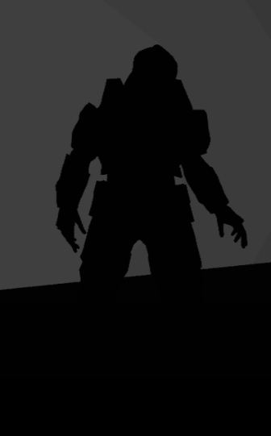
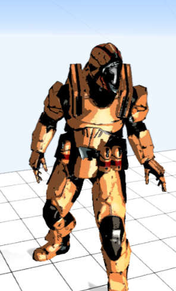
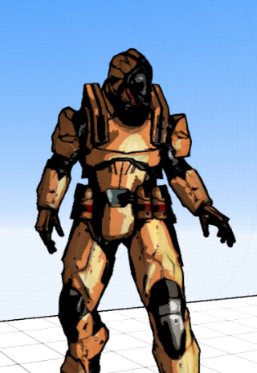

# Toon/Cel Shading Project Report
This report will go over the processes by which we implemented a 3D Toon Shader for the Phaser game engine using WebGL. The project was developed using TypeScript, GLSL, and Phaser's Enable3D plugin. Links for the project will take you to the GitHub repository and a hosted demo.

- **CSCE 5220 Computer Graphics**
- **Authors: Jeremy Glebe, Yen Pham**

## Links
- [Github Repo](https://github.com/jeremyglebe/Coursework-Project-Computer-Graphics)
- [Hosted Demo](https://jeremyglebe.com/Coursework-Project-Computer-Graphics/)

## Lighting Effects
In order to achieve the classic lighting of a cel-shader, we had to implement a system wherein light would be rounded off to preset thresholds of intensity. We obtained a total light value from an existing Phong lighting shader and from that template impelemented a simple rounding system.

The algorithm was as follows:
- Obtain the existing color value from earlier in the shader
- Set constants that would be used, such as number of thresholds
  - Calculate the threshold values by dividing maximum intensity (sqrt(3)) by the number of thresholds
- Calculate the intensity of the existing color, and which threshold it is closest to
- Determine the factor between the intensity and the threshold, then multiply to increase/decrease the intensity to the threshold (while keeping the original color)

The result is layers of light which, instead of smoothly blending, are instead rounded off to a preset number of thresholds. This gives the effect of a cartoonish, cel-shaded look.

```glsl
// Now try to set all colors to some preset magnitudes
vec3 old_light = outgoingLight;
// Determine what the thresholds should be based on number of thresholds
// and maximum color intensity
const int numThresholds = 4;
float maxThreshold = sqrt(3.0);
float minThreshold = 0.0;
float thresholds[numThresholds];
for (int i = 0; i < numThresholds; i++) {
    thresholds[i] = minThreshold + (maxThreshold - minThreshold) * (float(i) / float(numThresholds - 1));
}
// Get the magnitude of the color
float mag = length(old_light);
// Get the index of the threshold that is closest to the magnitude
int index = 0;
for (int i = 0; i < numThresholds; i++) {
    if (abs(thresholds[i] - mag) < abs(thresholds[index] - mag)) {
        index = i;
    }
}
// Determine the new light color
vec3 toon_light = old_light * (thresholds[index] / mag);
// Scale the color so its magnitude is equal to the threshold
gl_FragColor = vec4( toon_light, diffuseColor.a );
```

## Outlines
Drawing outlines around objects was much more of a challenge. Our process involves two rendering steps (one to a texture in memory) and a post-processing step.

- The first rendering step renders the scene as normal (with our toon lighting included) and passes that result to the outline post-processor.
  - This is the first rendering without any outlines 
    -   
  - This render step also stores a depth texture while rendering the scene.
- Baked into our post-processor is a second render step which renders the normals of the scene to a texture in memory. 
- Once both renderings are complete, we began post-processing over the resulting texture from the first render
- The outline pass renders a shaded quad over the existing texture, and that quad was what contains the outlines.
- The fragment shader did all the work. For each fragment it grabbed the color from the scene (first rendering), the depth from the depth buffer, and the normal from the normal texture.
- After it had those values, it calculated the difference between the normal of this fragment and its neighbors. Higher difference means that a line is needed (because we've encountered an edge). 
  - 
  - This is the result of rendering the normals of the objects. You'll see that high differences often highlight where surfaces on objects are interrupted. This helps to highlight individual surfaces within a mesh.
- Then it calculated the difference between the depth and the neighbor fragments' depth. High depth differences also result in an outline, because we've encountered the outer edge of an object.
  -   
  - What the depth buffer looks like when rendered. We can see how areas of high difference in depth should be outlined (between the character and the background, for instance, there should be outlined).
- Some basic math is done to ensure differences fit into our required range (saturating, for instance) and then the two differences are added together to get our overall outline value.

Finally, we returned the shaded quad where the colors for each fragment are a lerp between the original scene color and the outline color, based on the outline value calculated. This would form lines in areas where the differences are large, or otherwise show the original color.

This is the result of outlining with just the depth buffer:

  

Whereas this is the result of all the steps combined:



The combined outlines are noticeably sharper and produce a much stronger comic-book like effect, seeming almost like a sketch pen stroke.

The core code of our algorithm can be seen below, without including all of the helper functions.

```glsl
vec4 original = texture2D(originalTexture, vUv);
float depth = depthAt(0, 0);
vec3 normal = normalAt(0, 0);

// Get the difference between depth of neighboring pixels and current.
float depth_variance = 0.0;
depth_variance += abs(depth - depthAt(1, 0));
depth_variance += abs(depth - depthAt(-1, 0));
depth_variance += abs(depth - depthAt(0, 1));
depth_variance += abs(depth - depthAt(0, -1));

// Get the difference between normals of neighboring pixels and current
float norm_variance = 0.0;
norm_variance += distance(normal, normalAt(1, 0));
norm_variance += distance(normal, normalAt(0, 1));
norm_variance += distance(normal, normalAt(0, 1));
norm_variance += distance(normal, normalAt(0, -1));

norm_variance += distance(normal, normalAt(1, 1));
norm_variance += distance(normal, normalAt(1, -1));
norm_variance += distance(normal, normalAt(-1, 1));
norm_variance += distance(normal, normalAt(-1, -1));

depth_variance = saturate(depth_variance);
norm_variance = saturate(norm_variance);


float outline_lerp_value = norm_variance + depth_variance;
// Combine outline with scene color.
vec4 outline_solid = vec4(outlineColor, 1.0);
gl_FragColor = vec4(mix(original, outline_solid, outline_lerp_value));
```

The rendering steps are found in the following javascript method:

```js
render(renderer, wbuf, rbuf) {
    // The depth buffer needs to remain constant throughout the pass, so we toggle writing to it off and on.
    this.toggleDepthBufferWriting(wbuf);

    // Obtain a render of object normals. High difference in normals indicates an edge between surfaces.
    // This render will be stored on a separate texture, not rendered to the screen.
    renderer.setRenderTarget(this.normalRenderingTarget);
    // Shader replacement tool lets us temporarily change mesh materials to render only the normals.
    const shaderReplacement = new ShaderReplacement(ShaderLib.normal);
    shaderReplacement.replace(this.scene, true, true);
    // Render the normals
    renderer.render(this.scene, this.camera);
    // Restore the original shaders for future passes
    shaderReplacement.reset(this.scene, true);

    // Pass the depth buffer, normal rendering, and original colors to the shader
    /** @ts-ignore (Uniforms is a property of materials, no matter what TypeScript says) */
    this.shaderQuad.material.uniforms['depthTexture'].value = rbuf.depthTexture;
    /** @ts-ignore (Uniforms is a property of materials, no matter what TypeScript says) */
    this.shaderQuad.material.uniforms['normalTexture'].value = this.normalRenderingTarget.texture;
    /** @ts-ignore (Uniforms is a property of materials, no matter what TypeScript says) */
    this.shaderQuad.material.uniforms['originalTexture'].value = rbuf.texture;

    // 2. Draw the outlines using the depth texture and normal texture
    // and combine it with the scene color
    if (this.renderToScreen) {
        // If this is the last effect, then renderToScreen is true.
        // So we should render to the screen by setting target null
        // Otherwise, just render into the writeBuffer that the next effect will use as its read buffer.
        renderer.setRenderTarget(null);
        this.shaderQuad.render(renderer);
    } else {
        renderer.setRenderTarget(wbuf);
        this.shaderQuad.render(renderer);
    }

    // Restore write access to the depth buffer for any future passes.
    this.toggleDepthBufferWriting(wbuf);
}
```

Complete code can be found at the GitHub repository linked above.

## Conclusion
Algorithms for lighting in toon shading are relatively simple and consist primarily of rounding light values to intensity thresholds. Outlining, while much more complex, basically comes down to finding methods by which to texture differences between surfaces and objects, and then combining those with the primary rendering to draw dark lines. Depth and normals both work really well for this because they both change drastically at edges. There are also less procedural ways to generate outlines, such as storing surface ids in the model itself. These techniques might even look better in the long run, but the involve a lot more overhead to implement and are not as flexible. We are very happy with the results of this project, and hope that it can be used to make some cool projects in the future.

## Acknowledgements & Credits
This project is built using some third party technology and scripts. We claim no credit for the portions of the project which are sourced this way. All primary project objectives (Toon effects, outlines, etc) were implemented separately. Third party resources, and their purposes in this project, are described in the table below:

- Phaser.js Game Engine
  - A primarily 2D game engine for javascript, this allowed for easier demo by providing control callbacks and physics
- Enable3D
  - This is a 3D plugin for Phaser.js which integrates Three.js and Ammo.js to allow Phaser to run 3D games
  - Three.js
    - This is a wrapper on WebGL. It is useful because it comes with loaders for 3D models and some templates for shaders so that we could focus on shader code related to our project, instead of building from the ground up.
  - Ammo.js
    - This is a Bullet Physics implementation for javascript. We don’t use much physics, but it was useful and comes baked into Enable3D.
- ShaderReplacement tool
  - by Garrett K Johnson, a graphics engineer at NASA (https://github.com/gkjohnson/threejs-sandbox/tree/master/shader-replacement\)
  - This is a workaround for an older version of Three.js (which is the one that comes with our game engine) where Three.js did not have a means by which to override shaders on individual objects in render passes.


### Asset Credits

| Asset       | Source                  |
| ----------- | ----------------------- |
| Soldier.fbx | https://www.mixamo.com/ |
| Walk.fbx    | https://www.mixamo.com/ |


